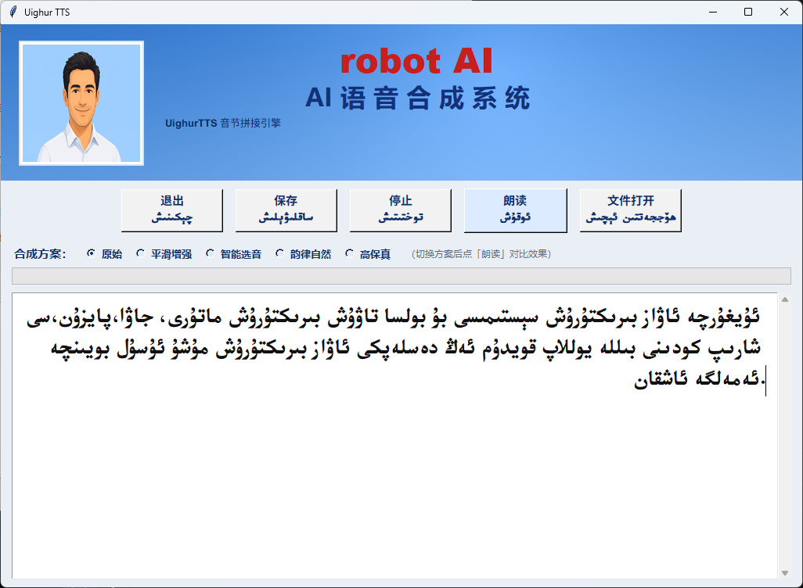

# UighurTTS — 维吾尔语语音合成系统

ئۇيغۇرچە ئاۋاز بىرىكتۈرۈش سىستېمىسى

基于**音节拼接**的维吾尔语 TTS 引擎，提供桌面 GUI、Web API 等多种使用方式。



## 功能特点

- **5 种合成方案**：原始 → 平滑增强 → 智能选音 → 韵律自然 → 高保真（PSOLA）
- **音节拼接引擎**：Hanning 窗 crossfade + 可选 PSOLA F0 平滑
- **多候选 join-cost 选音**：自动选取拼接代价最小的音节单元
- **韵律处理**：句读停顿 + 句末降调，合成更自然
- **RTL 维吾尔文**：原生右到左文本输入与显示
- **多语言实现**：Python / Java / C# / PHP

## 项目结构

```
├── tts_gui.py          # Python 桌面 GUI（Tkinter）
├── UighurTTS.py        # Python TTS 引擎核心
├── dada.db             # 音节数据库（SQLite）
├── data_parts/         # Lab.dat 分片（需合并后使用）
│   ├── Lab.dat.part00
│   ├── Lab.dat.part01
│   ├── Lab.dat.part02
│   └── merge_lab.py    # 合并脚本
├── assets/
│   ├── avatar.png
│   ├── UKIJTuT.ttf     # 维吾尔文字体
│   └── ui.png
├── java/               # Java 版本
├── csharp/             # C# / WPF 版本
├── php/                # PHP Web 版本（含 API）
└── lib/                # 打包的 Python 依赖
```

## 快速开始

### 1. 合并数据文件

克隆仓库后，先合并 `Lab.dat` 分片：

```bash
cd data_parts
python merge_lab.py
```

### 2. 运行 GUI

```bash
python tts_gui.py
```

### 依赖

- Python 3.x
- NumPy
- Pillow

## 合成方案说明

| 方案 | 说明 |
|------|------|
| 原始 (raw) | 30ms 拼接，首个单元 |
| 平滑增强 (smooth) | 50ms 拼接 + 响度归一化 |
| 智能选音 (smart) | 多候选 join-cost 选音 |
| 韵律自然 (prosody) | 选音 + 句读停顿 + 句末降调 |
| 高保真 (hifi) | PSOLA 基频平滑 + 句末降调 |

## 技术参数

- 采样率：16000 Hz
- 位深：16-bit
- 声道：单声道
- 数据格式：WAV
